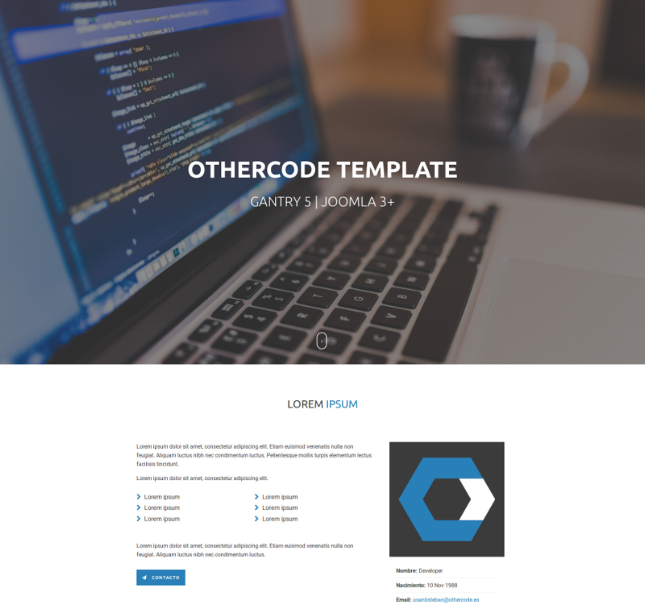

# otherCode Joomla 3.x Template

otherCode Joomla Template developed with Gantry 5



## Build Package

Run the following command:

```bash
bash build.sh
```

This will generate the installable `.zip` in `builds/` directory:

```bash
builds/g5_othercode.zip
```

## Configuration

Access to template configuration in: **Extensions > Template > Styles > [Template Name]**

#### Disclaimer

All used images are from **[pexels.com](https://www.pexels.com/)**.